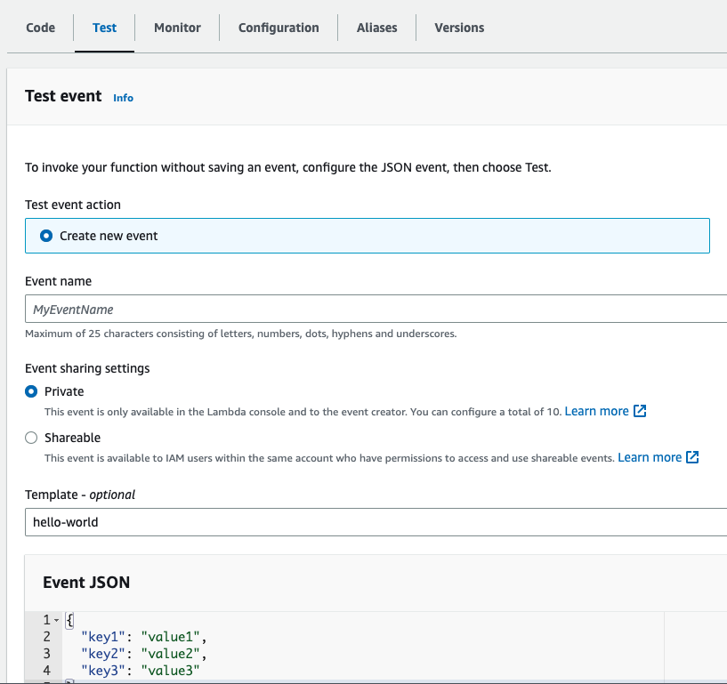

# Lambda function to create AWS role & policy, then attach policy to role

This project provides a sample lambda function which creates an AWS role and policy, then attaches the
created policy to the role.

## Motivation

This is an alternative method of creating roles and policies through the AWS console. It is most
suitable when
multiple roles and policies need to be created in succession.

# Requirements

* Java 11 runtime environment
* Gradle 7
* Bash shell/zsh (optional if you want to run the aws commands yourself)
* aws cli v1.17 or newer
    + If using v2, add `cli_binary_format=raw-in-base64-out` to your `~/.aws/config`

# Setting up locally

`$ git clone https://github.com/logicmonitor/cloud-samples.git`

`$ cd cloud-samples`

# Changing standard policy json

The default policy json for the role is in path `src/main/resources/policy.json`. If you wish to
edit that, please do so before proceeding further.

# s3 bucket creation

This step is needed to deploy artifacts related to the lambda function. We need to create an s3 bucket to
store the artifacts. Run the following command from the root level `cloud-samples`:

`$ ./create_aws_s3_bucket.sh <enter-a-bucket-name-to-create> <aws-profile-name> <aws-region>`

where <aws-profile-name> is the profile configured in `~/.aws/config`.

If you have your aws-cli setup with a single profile, you could also directly create a s3 bucket:

`$ aws s3 mb s3://<enter-a-bucket-name>`

Add `--region` option if you want it in a particular region. If you get any authentication error,
add `--profile <your-aws-profile-name>` in the command.

# Generate the artifacts

Let's package our java code as a zip. Run the following command from the root level of
project `cloud-samples`:

`./gradlew buildZip`

Gradle will generate the zip under the project in the path `build/distributions/cloud-samples.zip`.

# Deploy artifacts and lambda function - One time process

Now that you have created a s3 bucket and our lambda function artifact, let's deploy our lambda
function using the configuration file `template.yml`

The deploy script uses aws cloudformation to package the artifacts and create the lambda function.

`$ ./deploy.sh <aws-profile-name> <aws-region> <enter-a-lambda-function-name>`

Alternatively, you can run the following commands if your profile is already setup:

`$ aws --profile <your-profile-name> --region <region-in-which-you-want-this-created> cloudformation package --template-file template.yml --s3-bucket <your-s3-bucket-name-from-step-1> --output-template-file out.yml`

Make sure you have an out.yml file generated.

`$ aws --profile <your-profile-name> --region <region-in-which-you-want-this-created> cloudformation deploy --template-file out.yml --stack-name <enter-a-lambda-function-name> --capabilities CAPABILITY_NAMED_IAM`

You should see a successfully created stack message.

# Running the lambda function

Now, you can trigger the lambda function using events from aws console. This will create the role,
the policy, and will attach the policy to the role.

Navigate to aws console -> Lambda -> <your-lambda-function-name-with-an-identifier>

There should be a Test tab in your function.



Under the Event Json, supply your input for role and policy creation,

Eg.,

```json
{
  "principalAccountId": "123456789",
  "policyName": "my-policy-name",
  "externalId": "my-external-id-from-lm",
  "roleName": "my-role-name"
}
```

Test and Save this event if you are going to edit and use it for multiple role, policy creations.

This should have created your role with the proper trust entity (external-id), the policy, and attached the
policy to role.

# Reporting bugs

If there are any issues or security vulnerabilities you want to report, please add them to
the Issues section. The
maintainers of this project will review.
  
